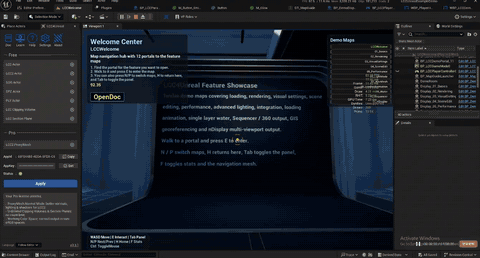

# 3dgs-unreal-example

[](https://github.com/xgrids/LCC-3DGS-Unreal-Plugin)
[](https://discord.gg/b99H8wjRaH)
[](https://developer.xgrids.com/#/forum)
[](https://www.xgrids.com/intl/lccUE)
[](https://www.xgrids.com/intl/lccUE)
[]()

[English](./README.md) | 中文

基于 [LCC-3DGS-Unreal-Plugin](https://github.com/xgrids/LCC-3DGS-Unreal-Plugin) 的 3D 高斯泼溅（3D Gaussian Splatting）示例工程。

按功能拆成 13 个独立关卡（外加一个导航入口 `LCCWelcome`），每个关卡只演示一件事：从加载一个 3DGS 场景，到渲染模式对比、裁剪、碰撞、导航网格、水体、Sequencer 出片、GIS 与多屏输出。想学哪块直接开对应关卡，不用从一堆蓝图里找线索。



*已 3 倍速。想看原速完整画质可[下载视频](https://github.com/xgrids/3dgs-unreal-example/raw/main/Media/Demo.mp4)。*

- 引擎版本：Unreal Engine 5.4 ~ 5.8（工程以 5.4 保存，可用更高版本打开）
- 插件版本：LCC4Unreal 3.3.1 及以上（Win64 / Linux）
- 支持的数据格式：LCC、LCC2、SOG、SPZ、PLY

> 本仓库只包含工程配置。内容包（`Content/`）和插件（`Plugins/`）需单独下载，这样 clone 很快。步骤见下。

## 快速开始

### 1. 克隆仓库

```bash
git clone git@github.com:xgrids/3dgs-unreal-example.git
cd 3dgs-unreal-example
```

用 HTTPS 也可以：

```bash
git clone https://github.com/xgrids/3dgs-unreal-example.git
```

仓库里只有 `Config/` 和 `.uproject`，clone 很快。

### 2. 下载内容包

关卡、蓝图和 3DGS 示例数据（约 470 MB）不放在 Git 历史里，而是作为 Release 附件分发。到 [Releases](https://github.com/xgrids/3dgs-unreal-example/releases) 页面下载 `Content.zip`，解压到仓库根目录，让 `Content/` 和 `.uproject` 平级：

```
3dgs-unreal-example/
├── Config/
├── Content/          ← 从 Content.zip 解压得到
│   ├── 3DGSData/
│   ├── Global/
│   ├── Maps/
│   └── ...
└── LCCUnrealExampleDemo.uproject
```

请下载与你 clone 的版本相对应的 Release。用旧版本的 `Content.zip` 配新版本的 `Config/` 可能出现资产引用丢失。

### 3. 下载 LCC4Unreal 插件

插件属于第三方发行内容，未随仓库分发。安装包从 XGRIDS 开发者中心获取（GitHub 仓库只提供说明与文档，不放二进制包）：

[下载页](https://developer.xgrids.com/#/download?page=LCC_UNREAL_SDK_UE54) · [插件仓库](https://github.com/xgrids/LCC-3DGS-Unreal-Plugin) · [文档](https://docs.xgrids.com/zh-cn/07-plugin-sdk/01-unreal/v3.3.1/01-introduction.html) · [官网](https://www.xgrids.com/intl/lccUE)

插件分 Free 与 Pro 两档。本工程的示例关卡在 Free 版下都能打开，多格式加载、LoD、深度与景深、碰撞、NavMesh、VR、nDisplay、Cesium 都属于 Free 范围；Proxy Mesh 重打光、自阴影、ACES / OCIO 色彩管线、无限制裁剪属于 Pro 功能。两档的完整对比见[插件仓库说明](https://github.com/xgrids/LCC-3DGS-Unreal-Plugin)。

关键一点：插件是按引擎版本分别构建的，下载的包必须和你实际使用的引擎版本一致，否则模块加载会失败。

| 项目 | 要求 |
| --- | --- |
| 插件版本 | 3.3.1 或更高 |
| 引擎版本 | 与你使用的引擎一致，5.4 / 5.5 / 5.6 / 5.7 / 5.8 各取对应包 |
| 平台 | Windows（win）或 Linux |

### 4. 安装插件

在仓库根目录新建 `Plugins` 文件夹，把解压后的插件整个目录放进去：

```
3dgs-unreal-example/
├── Content/
├── Config/
├── Plugins/
│   └── LCC4Unreal-v3.3.1-win-UE5_4/   ← 解压得到的目录，放这里（目录名随引擎版本不同）
│       ├── Binaries/
│       ├── Content/
│       ├── Resources/
│       ├── Shaders/
│       ├── Source/
│       └── LCC4Unreal.uplugin
└── LCCUnrealExampleDemo.uproject
```

目录名不必和上面完全一致，UE 只要求 `Plugins/` 下能找到 `LCC4Unreal.uplugin`。

### 5. 打开工程

双击 `LCCUnrealExampleDemo.uproject`。默认启动关卡是 `LCCWelcome`，它是所有示例的导航入口，可以从这里跳转到各个功能关卡。

工程文件以 5.4 保存。用 5.5 ~ 5.8 打开时，UE 会提示「用较新版本打开此工程」，选择转换副本或直接打开都可以；资产会在保存时升级到当前引擎版本，之后就不能再用 5.4 打开了，想保留 5.4 兼容性就别提交升级后的资产。

如果提示模块需要重新编译，选择「是」；纯二进制发行版通常无需编译。

### 6. 打包（可选）

本工程是纯蓝图工程，没有 `Source/` 目录。直接打包会失败，因为 LCC4Unreal 带 C++ 模块，需要工程自身能参与编译。打包前先转成 C++ 工程：

在编辑器里选 `Tools` → `New C++ Class`，随便建一个类（比如继承 `Actor`，名字保持默认即可）。UE 会自动生成 `Source/` 目录和 Target 文件，并提示重启编辑器。之后再走正常的 `Platforms` → `Windows` → `Package Project` 流程。

转换后工程需要安装 Visual Studio（Windows 平台需勾选「使用 C++ 的游戏开发」工作负载），否则无法编译。

## 操作说明

进入 PIE（点 Play）后，各示例关卡通用以下按键：

| 按键 | 功能 |
| --- | --- |
| `W` `A` `S` `D` | 移动 |
| `E` | 与场景中的交互点互动 |
| `Tab` | 开关功能面板 |
| `N` / `P` | 切到下一个 / 上一个示例 |
| `H` | 回到导航中心 `LCCWelcome` |
| `F` | 开关性能统计（FPS 等）与导航网格可视化 |
| `Ctrl` | 切换鼠标模式（视角控制 / UI 点击） |

关卡内左下角常驻这份按键提示，忘了随时可以看。

## 示例关卡

关卡都在内容包的 `Content/Maps/` 下。

| 关卡 | 内容 |
| --- | --- |
| `LCCWelcome` | 导航中心，示例总入口 |
| `01_Basics` | 最小可用示例：加载并显示一个 3DGS 场景 |
| `02_Rendering` | 渲染模式与渲染参数对比 |
| `03_VisualSettings` | 视觉调节：色彩、亮度等外观参数 |
| `04_SceneEdit` | 场景编辑：裁剪盒、变换、局部修改 |
| `05_Performance` | 性能相关设置与优化取舍 |
| `06_LightMode` | 光照模式，3DGS 与 UE 光照的配合 |
| `07_NavMesh` | 在 3DGS 场景上生成导航网格并驱动 AI 角色 |
| `08_LoadingAnimation` | 加载过程的过渡动画 |
| `09_Water` | 与 UE Water 系统混合（需 Water、WaterExtras 插件） |
| `10_Sequencer` | Sequencer 打点与 Movie Render Pipeline 出片 |
| `11_GIS_Cesium` | 与 Cesium for Unreal 结合的地理场景（见下方可选依赖） |
| `11_nDisplay` / `12_nDisplay` | nDisplay 多屏 / 拼接墙输出的两种配置 |

## 依赖插件

工程已在 `.uproject` 中启用以下引擎自带插件，无需额外安装：

`ModelingToolsEditorMode`、`Water`、`WaterExtras`、`MovieRenderPipeline`、`MoviePipelineMaskRenderPass`、`nDisplay`

可选依赖：

- `11_GIS_Cesium` 需要 [Cesium for Unreal](https://cesium.com/platform/cesium-for-unreal/)。该插件未在 `.uproject` 中启用，打开此关卡前请先自行安装并启用，否则关卡内的 Cesium Actor 会加载失败。其余关卡不受影响。

## 示例数据

插件支持的格式：

| 格式 | 说明 |
| --- | --- |
| `.lcc2` | XGRIDS 自研格式，当前主格式，支持深度、LOD、八叉树结构 |
| `.lcc` | XGRIDS 自研格式，已被 LCC2 取代 |
| `.sog` | 由 PlayCanvas 推出。走 LCC2 管线，支持深度，不支持 LOD |
| `.spz` | 由 Niantic Labs 推出，兼容 v2 / v3 / v4。走 LCC2 管线，支持深度，不支持 LOD |
| `.ply` | 标准 3DGS 点云格式，走 LCC2 管线，支持深度，不支持 LOD |

只有 LCC2 支持 LOD，所以大场景流式加载的示例都用它。内容包里 `Content/3DGSData/` 下按格式各放了一份数据：

| 路径 | 格式 |
| --- | --- |
| `lcc2/LCC2.lcc2`、`LCC2_1/LCC2.lcc2` | LCC2 |
| `lcc/meta.lcc` | LCC |
| `Strawberry.sog` | SOG |
| `R12.spz` | SPZ |
| `scene/scene_0.ply` | PLY |

想换成自己的数据，把文件放进 `Content/3DGSData/`，再在关卡里替换对应 Actor 的数据路径即可。

## 常见问题

打开工程提示找不到 LCC4Unreal 模块

两种常见原因。一是 `Plugins/` 目录没放对，确认 `Plugins/<插件目录>/LCC4Unreal.uplugin` 这条路径存在；二是插件构建版本和引擎版本不匹配，比如用 5.6 的引擎装了 5.4 的插件包，到 [下载页](https://developer.xgrids.com/#/download?page=LCC_UNREAL_SDK_UE54) 换成对应版本即可。

工程能打开但资产缺失，或者找不到关卡

内容包没解压，或者解压位置不对。`Content/` 必须和 `LCCUnrealExampleDemo.uproject` 平级，不能多套一层目录。

场景一片空白、看不到 splat

先确认 `Content/3DGSData/` 下的数据文件完整（大文件可能因网络中断没拉全），再检查 Actor 上的数据路径是否指向了正确文件。

打包报错，提示缺少 Target 文件

本工程是蓝图工程，需要先转成 C++ 工程，见上面的打包步骤。

关卡里的 Cesium Actor 报错

参见上面的可选依赖，需要单独安装 Cesium for Unreal。

以上只是这个示例工程本身容易踩的坑。插件的使用问题（渲染异常、性能调优、格式导入等）见官方 [FAQ](https://docs.xgrids.com/en-us/07-plugin-sdk/01-unreal/v3.3.1/19-faq.html)。

## 说明

本仓库只包含示例工程与示例数据。LCC4Unreal 插件由 XGRIDS 开发与发行，其许可与使用条款请以官方说明为准。

[插件仓库](https://github.com/xgrids/LCC-3DGS-Unreal-Plugin) · [文档](https://docs.xgrids.com/zh-cn/07-plugin-sdk/01-unreal/v3.3.1/01-introduction.html) · [常见问题](https://docs.xgrids.com/en-us/07-plugin-sdk/01-unreal/v3.3.1/19-faq.html) · [论坛](https://developer.xgrids.com/#/forum) · [Discord](https://discord.gg/b99H8wjRaH) · [官网](https://www.xgrids.com/intl/lccUE)
